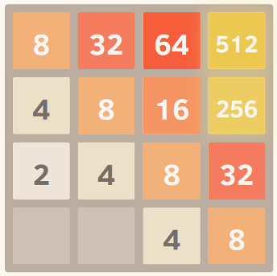
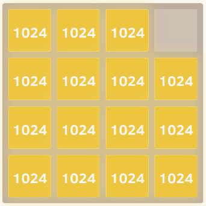

---

## Abstract

A super fast 2048 game solver using expectiminimax adversarial search. Utilize alpha-Beta pruning and some special design efficient heuristic functions to achieve high efficiency and good performance(0.2s calculation time for each step and near 100% chance of reaching 2048).

---

## Implementation

### 1. Monocity

This heuristic tries to ensure that the values of the tiles are all either increasing or decreasing along both the left/right and up/down directions. This heuristic alone captures the intuition that many others have mentioned, that higher valued tiles should be clustered in a corner. It will typically prevent smaller valued tiles from getting orphaned and will keep the board very organized, with smaller tiles cascading in and filling up into the larger tiles.

##### An example of the perfect monotonic grid

### 2. Smoothness

The above heuristic alone tends to create structures in which adjacent tiles are decreasing in value, but of course in order to merge, adjacent tiles need to be the same value. Therefore, the smoothness heuristic just measures the value difference between neighboring tiles, trying to minimize this count.

##### An example of the perfect smooth grid

---

## Code

[Github](https://github.com/ErvinZzz/efficient_2048_solver)