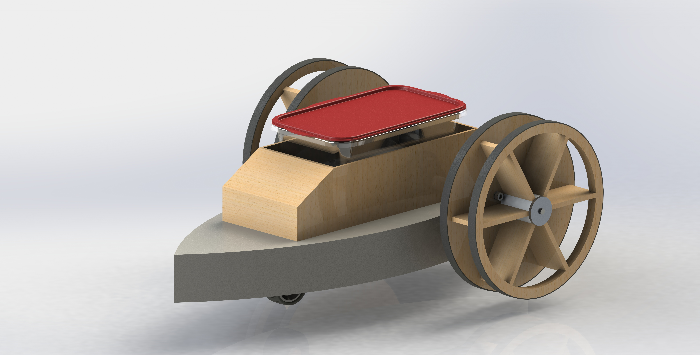
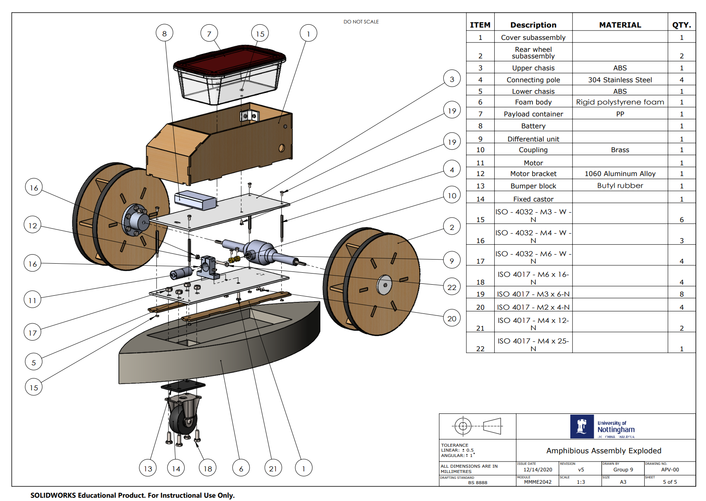
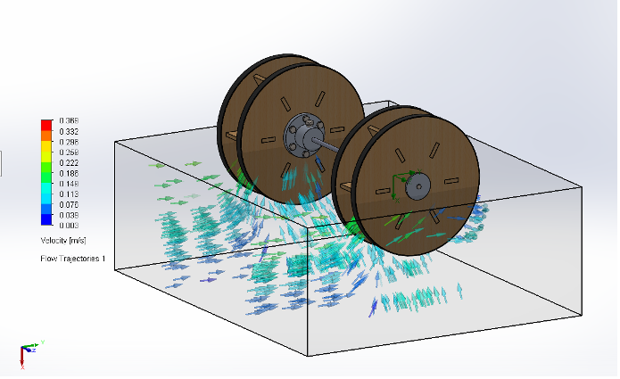
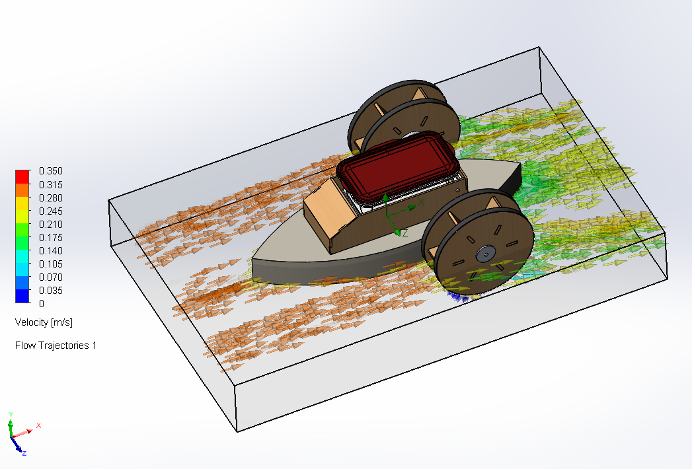
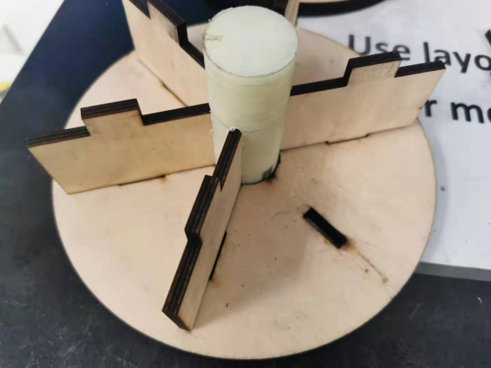
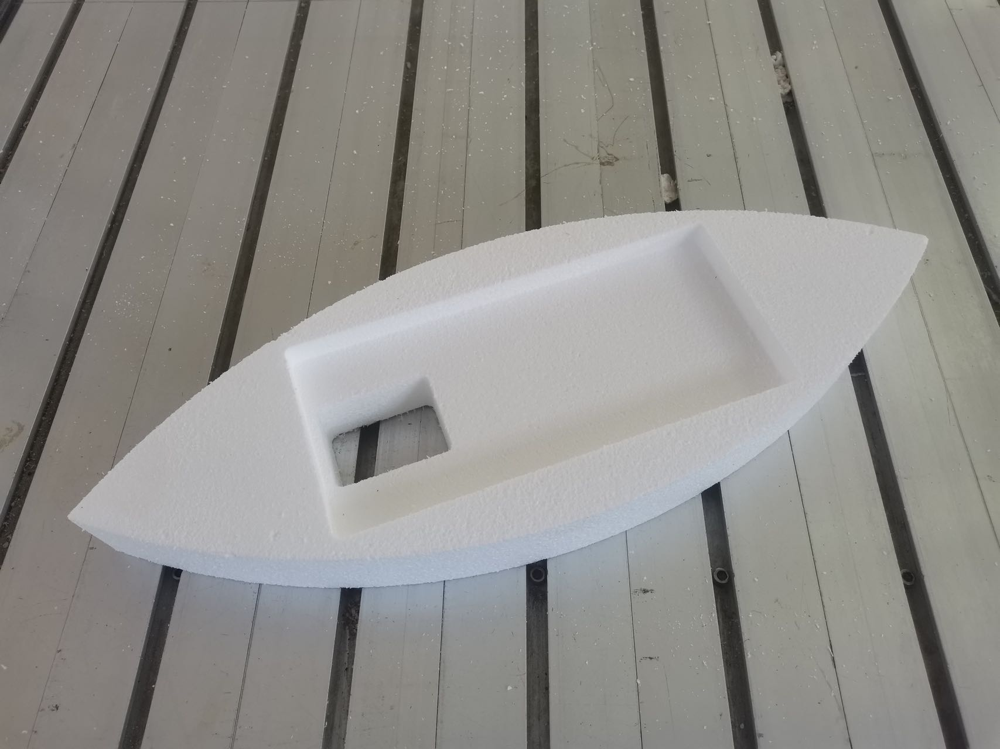

---

##### Abstract

A differential-drive water-land amphibious vehicle.

##### Design

In order to achieve light weight and high efficiency, the drive system was designed as a differential transmission requiring only one motor drive.

##### Simulation

The validation of water and land movement is achieved through CFD evaluation.

##### Manufacturing

Craft the amphibious wheels using 3D printing, milling, drilling and laser cutting.

Craft the foam body using the foam CNC machine.

