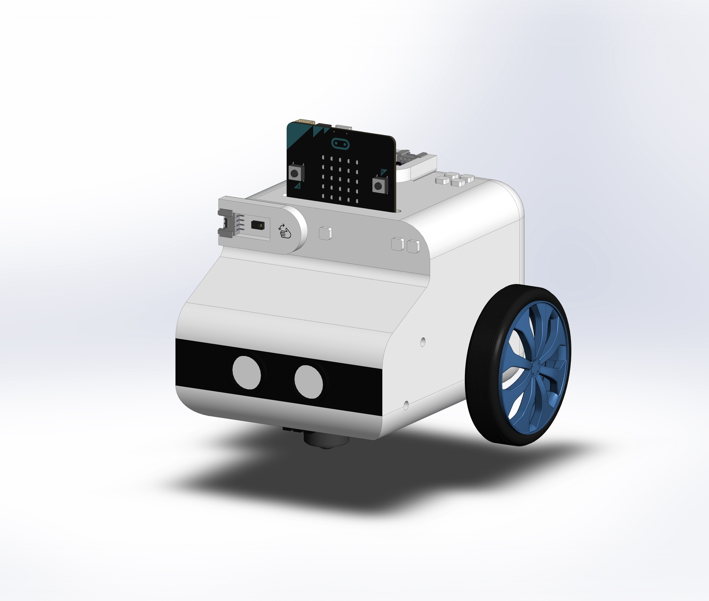
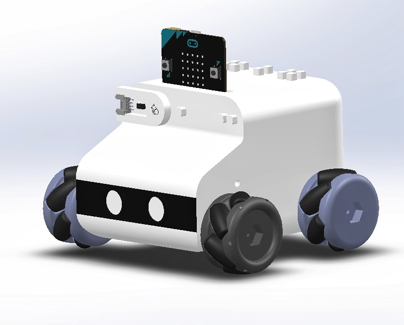

---

##### Abstract

The design goal is to be modular and expandable to support users in learning the multiple sensors and locomotion of the wheeled robot. The robot is powered by [Micro::bit](https://microbit.org/).

##### Transformable

Offers a wide range of wheeled robot locomotions, including differential and omnidirectional drives.

+ Differential Drive

+ Mecanum Wheel

##### Extendable

Provides a variety of sensor modules, through the hot-swap to realize the expansion and replacement of sensors.

+ Initial Status

+ Micro::bit and Gesture Detection Sensor Inserted

