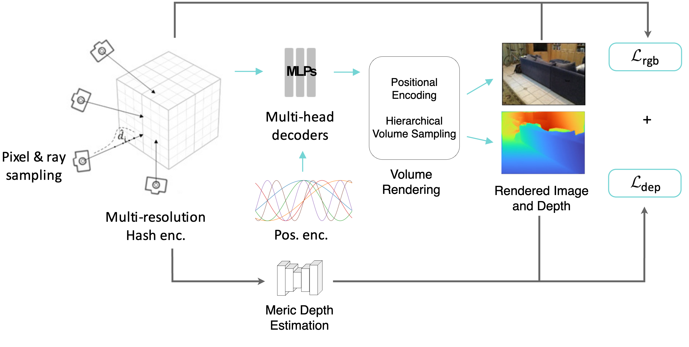
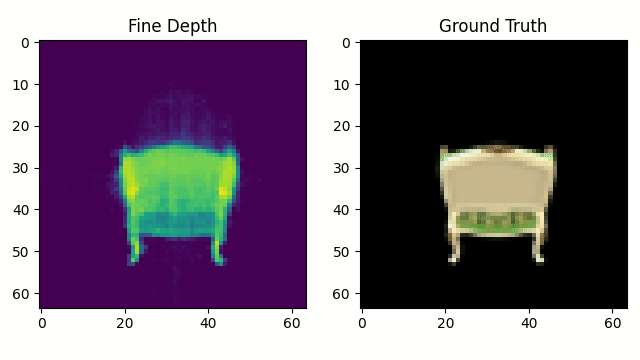
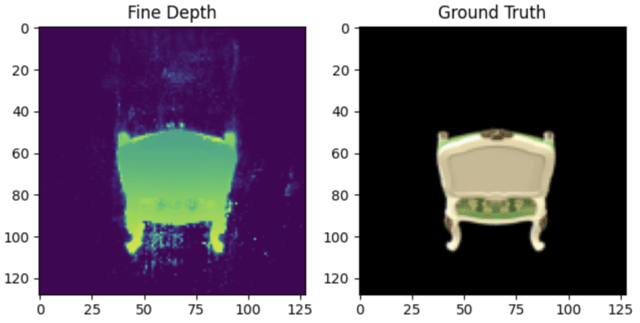

---

## Abstract

Neural radiance fields (NeRF) encode a scene into a neural representation that enables photo-realistic rendering of novel views. Neural However, a successful reconstruction from RGB images requires a large number of input views taken under static conditions — typically up to a few hundred images for room-size scenes, and the prediction of volume density is usually not as accurate as the RGB, which leads to ghostly artifact issues. To address this issue, a metric depth learning module is incorporated with the classic NeRF framework to leverage the depth prior for faster training speed and better rendering quality.

---

## Overview of the Architecture

---

## Loss Function

$$
L=L_{rgb}r+\lambda_dL_{Depth}
$$
where $\lambda_d$ represents the weight of $L_{Depth}$.

---

## Results

Reconstructed model's depth map with depth learning prior(Proposed):

Reconstructed model's depth map without depth learning prior(Original NeRF):

Final Rendering Results:

