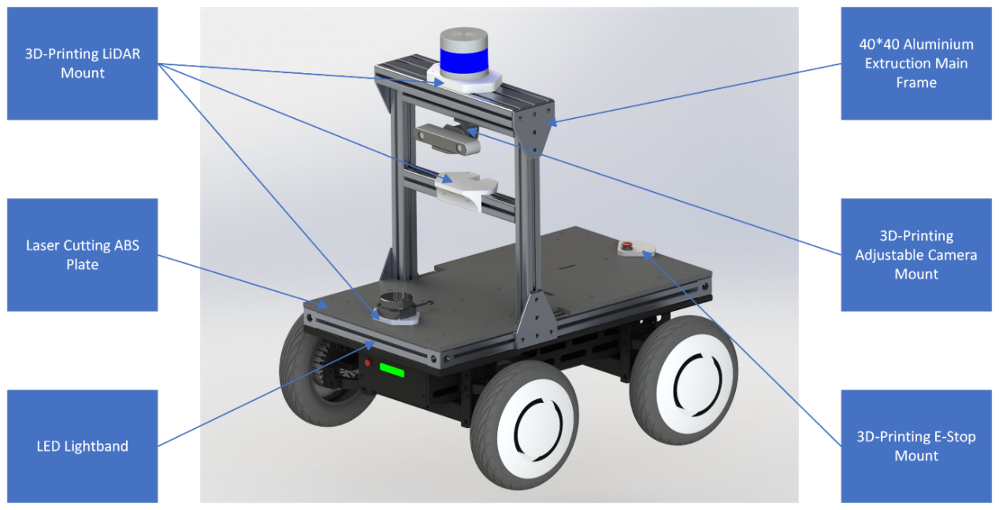
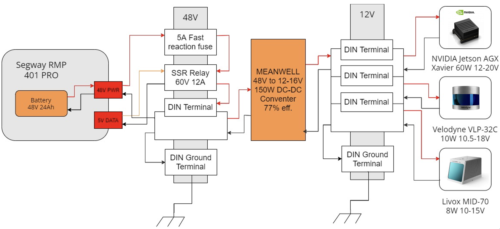
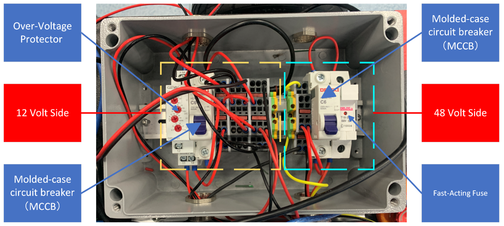
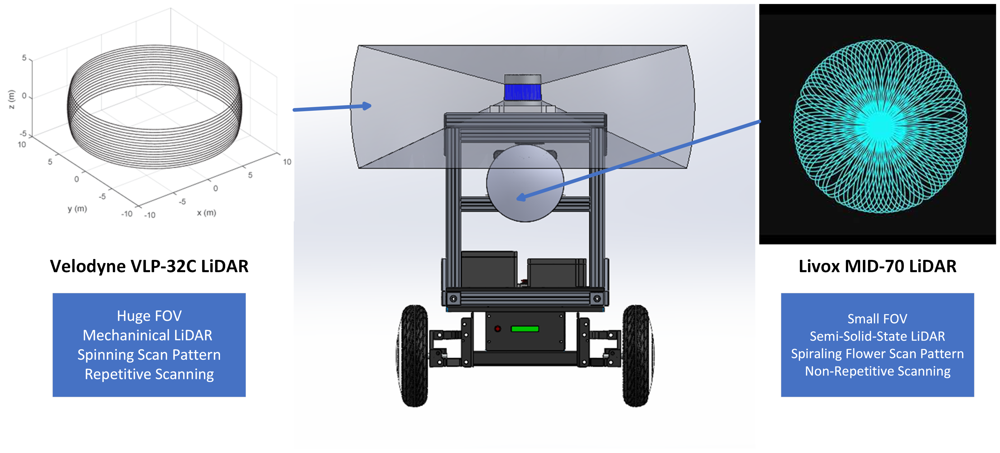
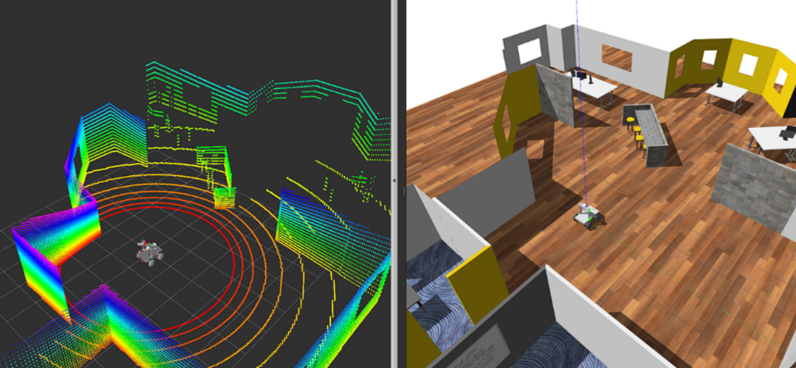
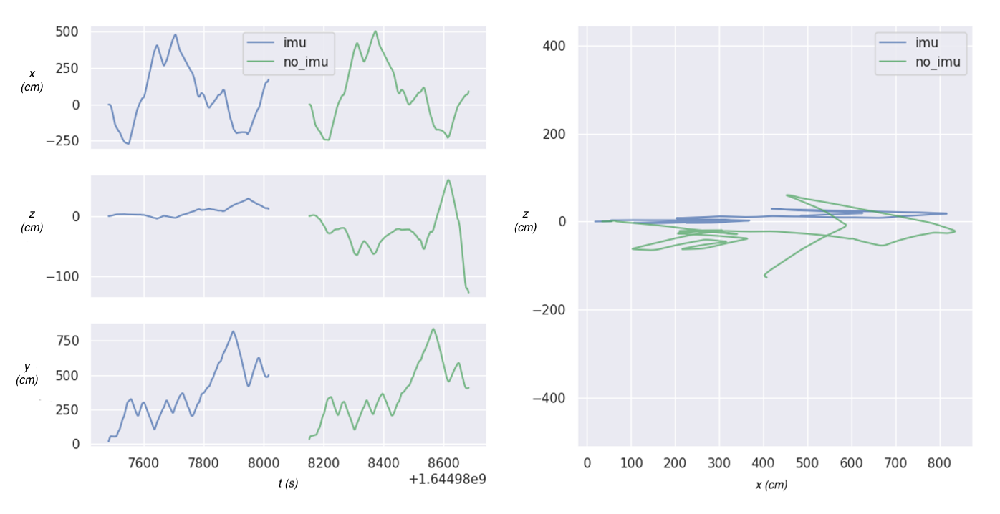
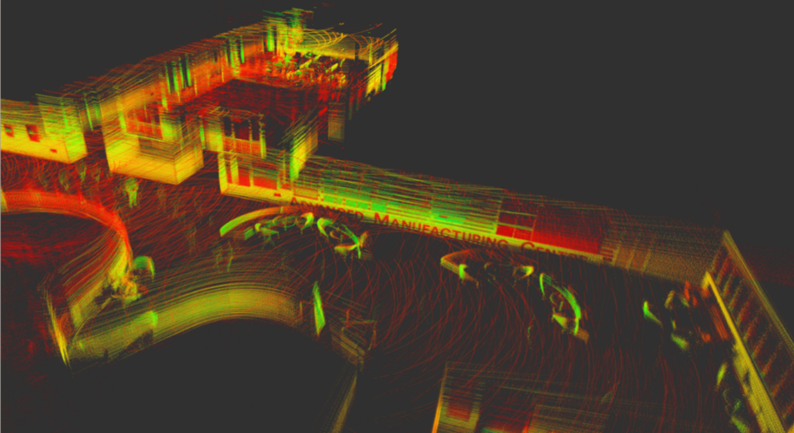
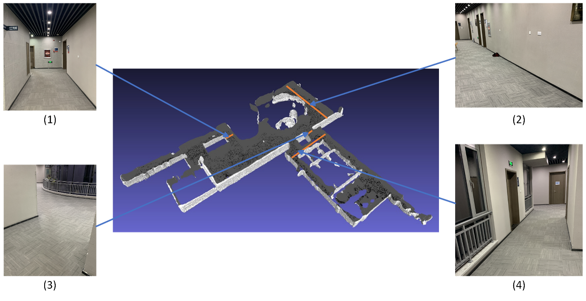
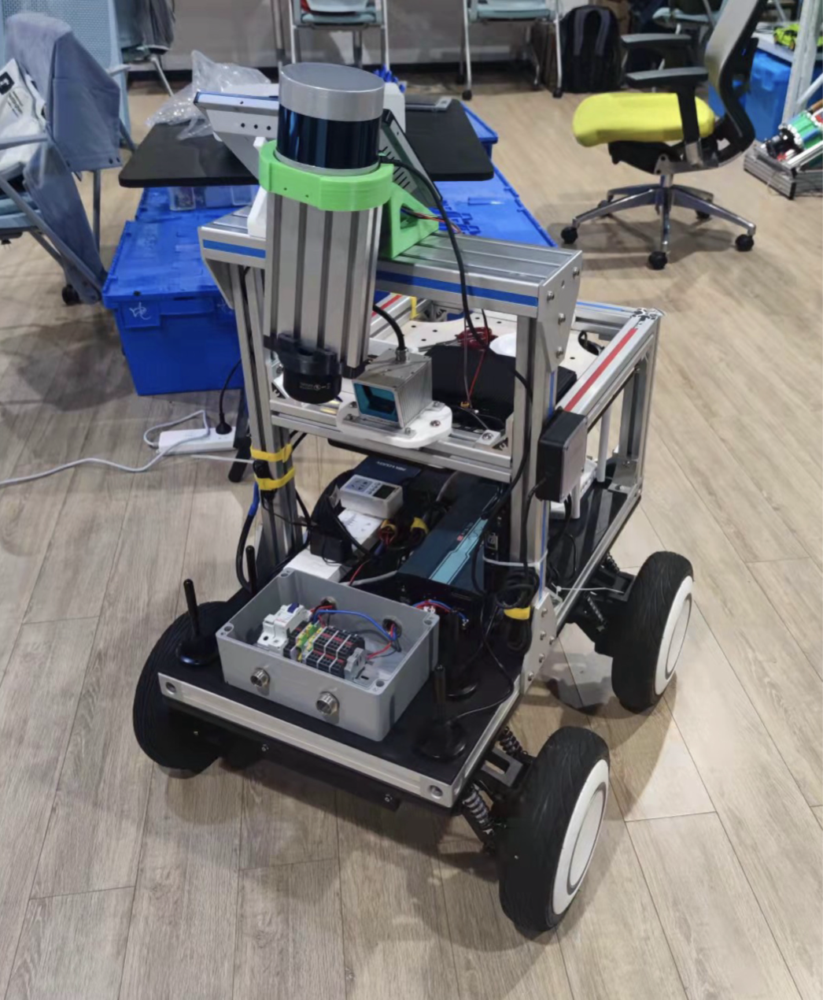

##### Abstract

Traditional as-built Building Information Modeling (BIM) is a costly, time-consuming and dangerous task. The use of robotics technology to automate this task is a promising and valuable research.

---

##### Hardware

In order to achieve a robust, modular, and expandable design, the design of [Carter 2.0 from NVIDIA](https://docs.nvidia.com/isaac/archive/2021.1/doc/tutorials/carter_hardware.html) is referenced.

A sensor fusion system was designed to enable the acquisition of dense environmental point clouds while preventing perceptual degradation in indoor environments.

---

##### Software

The Software is built upon [ROS](https://www.ros.org/) and the simulation environment is built in [Gazebo](https://classic.gazebosim.org/).

The LiDAR Odometry and Mapping (LOAM) algorithm is modified from Ji Zhang's [original implimentation](https://github.com/HKUST-Aerial-Robotics/A-LOAM). To make full use of the spinning LiDAR and the solid state LiDAR, the front end is modified to support multi-LiDAR fusion with a calibration matrix. Besides, IMU data is used in the ICP (Iterative Closest Points) scan matching for a better localization and mapping performance (especially in dealing with drift in z axis).

---

##### Results

Some reconstruction results at Sir David and Lady Susan Greenaway Building (IAMET), UNNC.

Finalized Design.

---

##### Credits

This project was funded by a $15,000 grant from [Glodon](https://www.glodon.com/en/), a leading digital building platform service provider.

---

##### Related material

+ [Presentation slides](presentation1.pdf)

