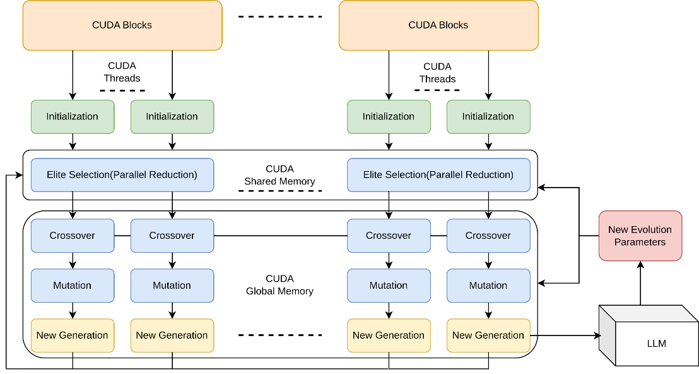
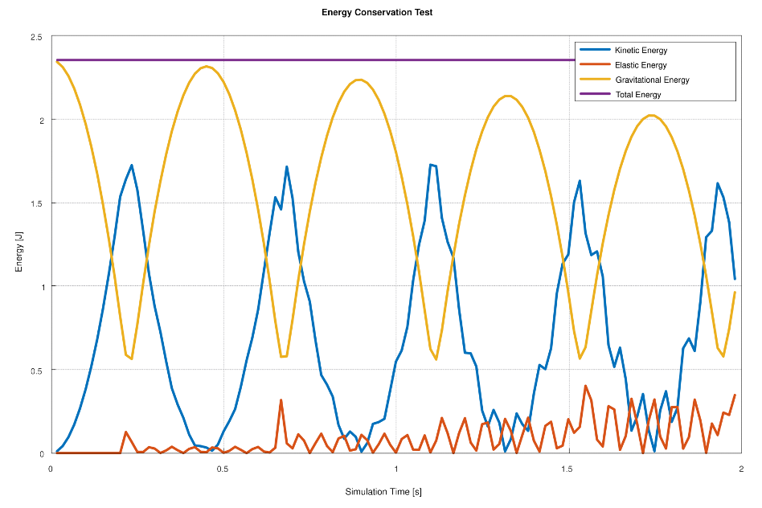
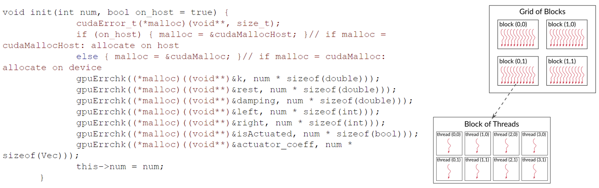
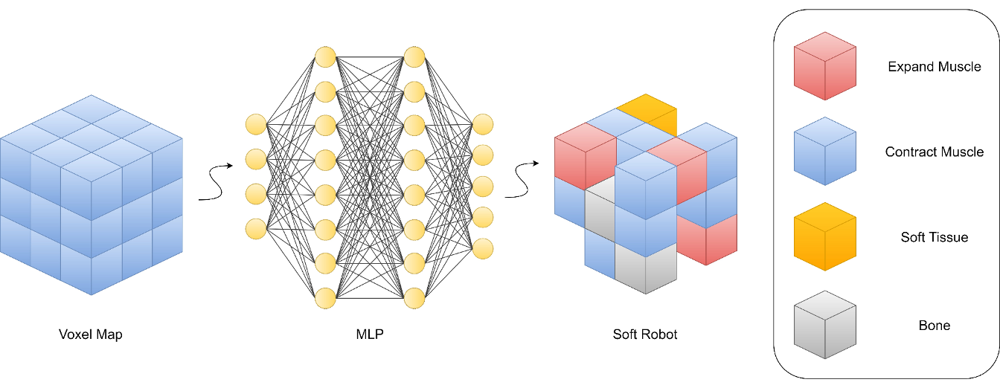
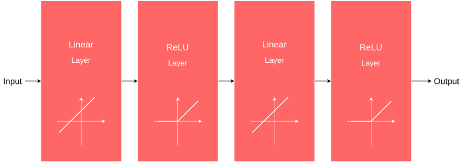
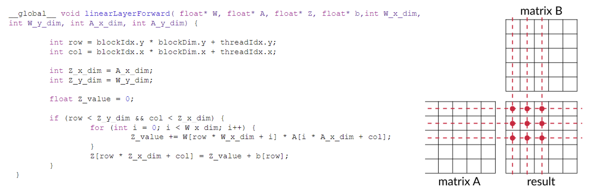
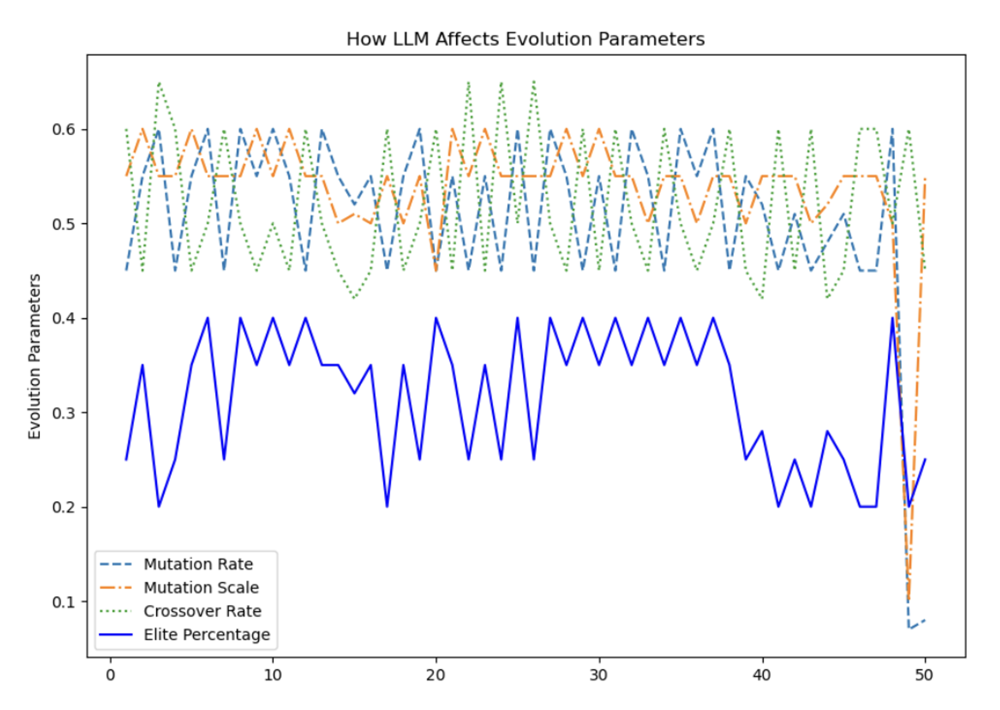
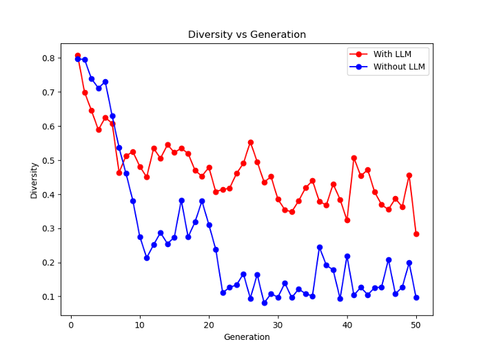

---

##### Overview

---

##### CUDA-Accelerated Physics Simulation

---

##### CUDA-Accelerated Implicit Encoding and Neural Evolution

---

##### Large Language Model Supervision

---

##### Results 

---

##### Related material

+ [Presentation slides](pre.pdf)